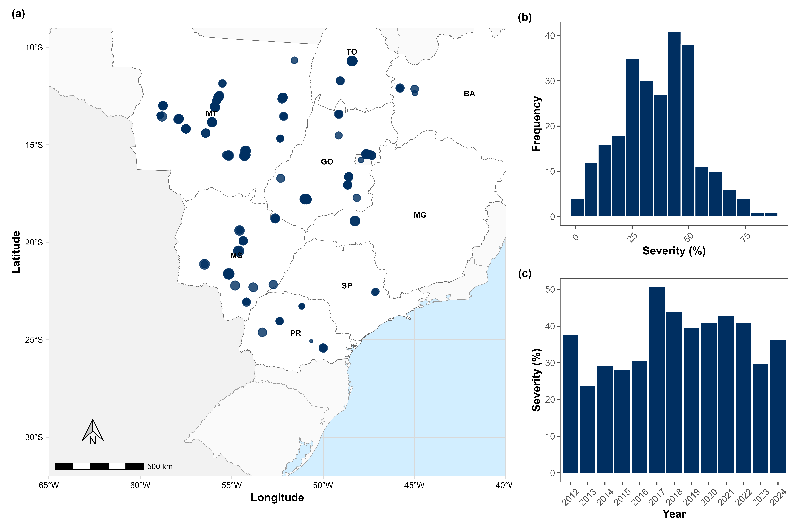

Our study aimed to characterize weather variables across the different epidemiological phases of target spot epidemics

A preprint version of this work has been available at [here](.).

------------------------------------------------------------------------

## Review

<div style="text-align: justify;">

Target spot is a foliar disease caused by *Corynespora cassiicola*, a necrotrophic fungus capable of reducing soybean yields worldwide. Since its first report in the state of Mato Grosso, the disease has been observed under high disease pressure across various soybean-growing regions in Brazil, encompassing diverse climatic conditions, including the states of Goiás, Tocantins, Bahia, Mato Grosso do Sul, Minas Gerais, São Paulo, and Paraná. Its adaptability to various climates and the current unavailability of resistant cultivars pose a substantial economic threat to Brazilian soybean production 

</div>

------------------------------------------------------------------------

## Why is this study important?

<div style="text-align: justify;">

Under controlled conditions, the epidemiological parameters of *Corynespora cassiicola*—such as lesion size and number, spore length, germination, and sporulation rates—are affected by fluctuations in temperature and humidity. However, despite its growing relevance, there is still limited understanding of how environmental factors in different epidemiological phases of the target spot can influence the epidemics under natural field conditions.

</div>

{fig-align="center" width="100%"}

------------------------------------------------------------------------

## Who am I?

::: {style="display:flex; align-items:center; gap:20px; margin-top:20px;"}
```{=html}

```

<p style="max-width:600px;">

I'm Ricardo G. Tomaz, a Brazilian PhD Student in Plant Pathology (UFV) and I am doing my PhD Sandwich Program at LSU (EUA). I have strong expertise in crop disease epidemiology, predictive modeling, and yield-loss simulation in crops such as soybean, wheat, and maize. In addition, I have worked with remote sensing to identify and quantify important disease in rice.

</p>
:::

------------------------------------------------------------------------

## Let me know something

📧 **rtomaz\@agcenter.lsu.br**